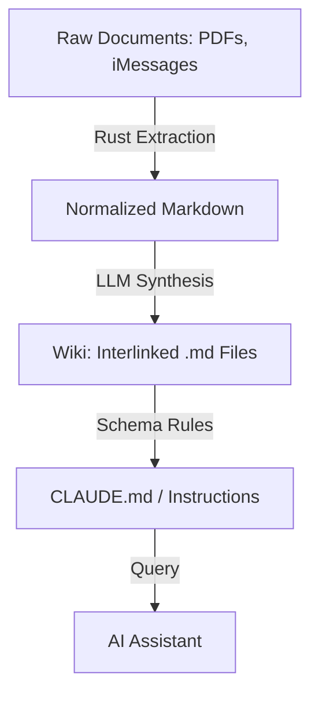

# Technical Proposal: Transitioning to an "LLM Wiki" Architecture

**Objective**: Replace stateless Retrieval-Augmented Generation (RAG) with a persistent, compounding Knowledge Base for legal case management.

---

## 1. The Core Philosophy: "The Compiler Analogy"
In standard RAG, we treat documents as data to be searched. In the LLM Wiki pattern, we treat raw documents (PDFs, iMessages) as **source code** and the Wiki as the **compiled binary**.

- **Ingestion (Compile Time)**: When a file is "synced," the LLM reads it and updates a structured set of Markdown files (the Wiki).
- **Query (Run Time)**: The AI assistant reads the Wiki first to answer questions, ensuring it has the "big picture" context of the case.

### Visual Representation


---

## 2. Proposed Architecture (Django + Rust + LLM)
We maintain the existing 3-pane UI but reorganize the backend data flow into a **3-Layer Architecture**:

| **Layer** | **Component**          | **Description**                                      |
|-----------|------------------------|------------------------------------------------------|
| Layer 1    | Raw (Rust/Django)     | Immutable "source of truth" (Original PDFs + Machine-readable .md/.json). |
| Layer 2    | Wiki (LLM-Maintained) | A folder of interlinked .md files (e.g., `timeline.md`, `witness_list.md`, `evidence_links.md`). |
| Layer 3    | Schema (CLAUDE.md)    | The "Rulebook" that tells the LLM how to format the Wiki and what entities to track. |

---

## 3. The "Sync" Pipeline (Technical Specs)
1. **Extraction (Rust)**: High-speed OCR and conversion of raw files to normalized Markdown.
2. **Synthesis (LLM Agent)**:
   - Reads the new document.
   - Reads relevant existing Wiki pages.
   - Updates summaries, appends to the timeline, and creates new "Entity Pages" for people or organizations.
   - **Crucial**: Every update must include a citation back to the Layer 1 source file.
3. **Linting (Maintenance)**:
   - Periodically, a "Lint" task runs to check for contradictions between Wiki pages (e.g., "Witness A said X on Tuesday, but Witness B says A was at Y").
   - **Trigger**: On every sync, daily, or manually (configurable).
   - **Responsibility**: Legal team reviews and resolves contradictions.

---

## 4. Why This Wins for Legal Tech
- **Contextual Persistence**: The AI doesn't "forget" the case details between chat sessions.
- **Auditability**: Senior devs and lawyers can open the `wiki/` folder and manually verify or edit the AI's "understanding" of the case.
- **Multi-Tenancy**: We scope the Wiki to the `case_id`. There is zero risk of data leakage because the LLM only ever "sees" the folder belonging to that specific case.
- **Reduced Hallucination**: By forcing the LLM to write down its findings in a structured Wiki, we catch logic errors during the "Compile" phase rather than during a live chat with a user.

---

## 5. Suggested First Step for Devs
Before refactoring the whole app, create a single "Case Folder" with a `/raw` and `/wiki` sub-directory. Manually run Karpathy's "LLM Wiki" prompt (from his April 2026 Gist) against a set of 5 related case documents using a high-context model.
If the resulting `timeline.md` and `witness_list.md` look like something a junior associate would spend 10 hours writing, you know the architecture is solid.

**Quick Question for Devs**: Are we comfortable using `pgvector` as a hybrid—using the Wiki for reasoning, but keeping the vector index for finding "needle in a haystack" quotes in 1,000+ page transcripts?

---

## 6. Conflict Resolution Protocol
To ensure consistency and reliability:

1. **Detection**: Linting task flags contradictions (e.g., conflicting dates, statements).
2. **Escalation**: Contradictions are logged in `contradictions.md` and reviewed by the legal team.
3. **Resolution**: Legal team updates the Wiki and marks the conflict as resolved.

---

## 7. Handling Misrepresentations: The "Source Bias" Metadata Tag
This is a classic "Conflict of Truth" problem in legal data engineering. In a standard RAG system, the AI treats all text as equally true. In the LLM Wiki model, you handle this by introducing **Source Metadata and Adversarial Labeling**.

### 1. The "Source Bias" Metadata Tag
When a user uploads a document, the UI should require (or intelligently guess) the **Originating Party**. In the Django database and the Markdown "Raw" files, prepend a header that sets the "vibe" for the LLM.

**Example Raw Markdown Header**:
```markdown
---
document_id: 2026-CV-001
source_party: DEFENDANT (Adversarial)
document_type: Motion to Dismiss
reliability_note: Contains contested allegations.
---
```

---

## 8. The "Dual-Timeline" Strategy
Instead of one single `timeline.md`, have your "Compiler" agent maintain a **Contested Timeline**.

### Verification Criteria
| **Category**            | **Criteria**                                  | **Example**                          |
|-------------------------|---------------------------------------------|--------------------------------------|
| Stipulated/Verified     | Cited in court filings or mutual agreement   | Contract signing date                |
| Contested Allegations   | Claimed by one party, disputed by another    | "Defendant was late" (Plaintiff's claim) |

### Prompt for the LLM During Sync
```
Analyze this document. For every event found, categorize it into one of two buckets:
1. Stipulated/Verified: (e.g., The date a contract was signed, court filing dates).
2. Contested Allegations: (e.g., 'The Defendant claims the Plaintiff was late').

If the source is 'Adversarial,' cross-reference it against existing 'Verified' events and flag any discrepancies in the contradictions.md file.
```

---

## 9. "Cross-Examination" Prompts
In the 3rd-pane AI Assistant, modify the system prompt to reflect the reality of litigation. Give the agent a **"skeptical" persona**.

### System Prompt Instruction
```
When answering questions:
- Prioritize facts from Verified sources.
- If you cite an Adversarial source, you MUST use phrases like 'The [Party] alleges...' or 'According to the contested filing...'.
- Do not state adversarial claims as objective facts.
```

### Adversarial Prompt Examples
- **User Query**: *"When was the contract signed?"*
  **LLM Response**: *"The contract was signed on 2023-10-15 (Verified: Court Filing #123)."*

- **User Query**: *"Did the defendant breach the contract?"*
  **LLM Response**: *"The Plaintiff alleges the defendant breached the contract on 2023-11-20 (Contested: Plaintiff's Filing #456). The defendant denies this claim."*

---

## 10. Technical Implementation (The "Salt" Filter)
Since you are using Rust, bake this logic into your ingestion script:

1. **Party Mapping**: Create a simple lookup in Django: `Party A = Client`, `Party B = Opposing`.
2. **Visual Indicators**: In your Timeline (Pane 1), color-code the events:
   - Green for your docs.
   - Red for theirs.
3. **The "Grain of Salt" Weight**: If you use vector search, boost the importance of your own documents in the search results and bury the opposing party’s claims unless specifically asked for.

### Citation Tracking System
Every Wiki entry **must** include:
- A **unique claim ID** (e.g., `CLM-2023-10-15-001`).
- A **source reference** (e.g., `Layer1/PDFs/filing_123.pdf`).
- A **version history** (e.g., *"Last updated: 2026-04-29, Reviewed by: [Legal Team]"*).

---

## 11. Scalability and Auditability
### Scalability
- Use **modular Wiki files** to organize content by case, topic, or date.
- Archive old events to keep the Wiki manageable.
- Implement **hierarchical organization** for large cases.

### Auditability
- Assign **unique IDs** to each claim for traceability.
- Maintain a **version history** for all Wiki pages to track changes over time.

---

## 12. Summary for Senior Devs
To handle misrepresentations, we aren’t just indexing text; we are indexing **Claims**. By adding a `source_party` attribute to our document metadata, we allow the LLM Wiki to act as a **"Fact Checker."** The Wiki doesn’t just store what happened; it stores **who said it happened**, which is the cornerstone of legal reasoning.

---

## 13. Next Steps
1. **Finalize Documentation**: Review and approve this updated proposal.
2. **Stakeholder Alignment**: Share the Mermaid diagram and adversarial prompt examples with the legal team for feedback.
3. **Pilot Testing**: Propose a small-scale pilot (e.g., one case) to test the Wiki’s scalability and conflict resolution before full rollout.
4. **Implementation**: Translate the changes into the **Hiver Django codebase** (e.g., add the Mermaid diagram, conflict resolution logic, and citation tracking).